# Overview

Our objective in this project is to construct a new Github repository from the ground up and establish the necessary framework for executing both Continuous Integration and Continuous Delivery.

To accomplish this, we will utilize Github Actions in conjunction with a Makefile, requirements.txt, and our application code to execute an initial linting, testing, and installation process.

Additionally, we will integrate this project with Azure Pipelines to facilitate Continuous Delivery to Azure App Service.
Throughout this endeavor, we will leverage Azure Cloud Shell.

## Project Plan

- [Trello Board](https://trello.com/b/DvAKdGrF/azuredevops)
- [Master plan](https://docs.google.com/spreadsheets/d/e/2PACX-1vRM8P94FRDbFilQWFvaSy6SFM6gJvpEhMLXAhQV13f9_vVSkxZLY9rQ-1zhehMBXfJScRjXonAmt9V9/pubhtml)

## Instructions

- Architectural Diagram

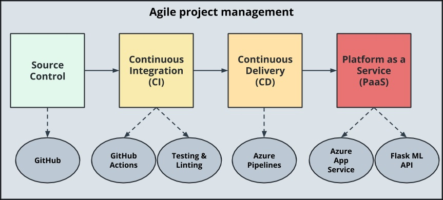

### Configuring Github
- First of all, we need to create a ssh key for access to Github.

- Create a ssh key

  ```bash
  ssh-keygen -t rsa -b 2048 -C "nhattan2007@gmail.com"
  ```

- Copy your key to SSH and GPG keys (https://github.com/settings/keys)

- Screenshot of SSH Key in Github
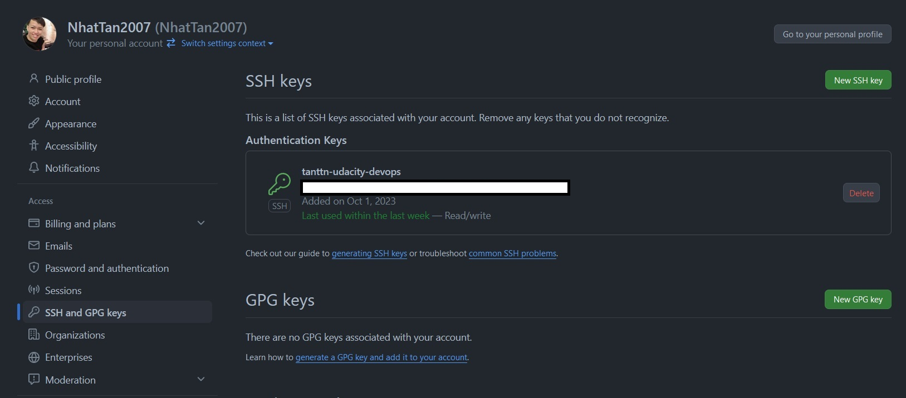

### Project Locally
- Cloned Project into Azure Cloud Shell


- Create and active virtual env:

  ```bash
    python3 -m venv ~/.tanttn-udacity
    source ~/.tanttn-udacity/bin/activate
  ```

- Install dependencies and make test, lint with Make file:
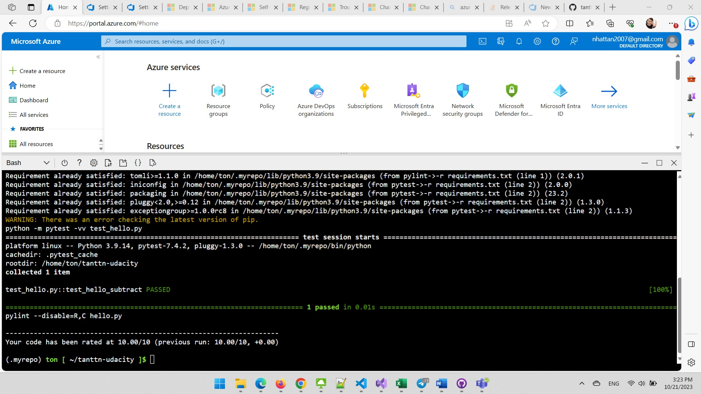

- Run application

```bash
    export FLASK_APP=app.py
    flask run
```

- Run prediction with local at Azure Cloud Shell
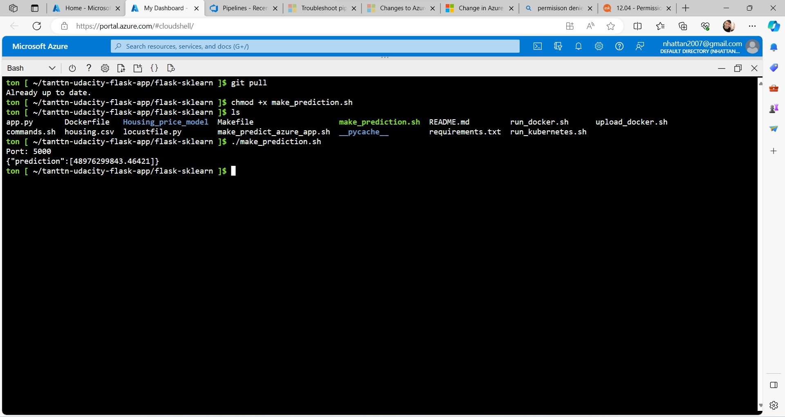

### Azure Web App

- Run script to create web app and first deployed to web app

```bash
    ./commands.sh
```

- Web App was created after run script (your can modify variables by your self at that file)
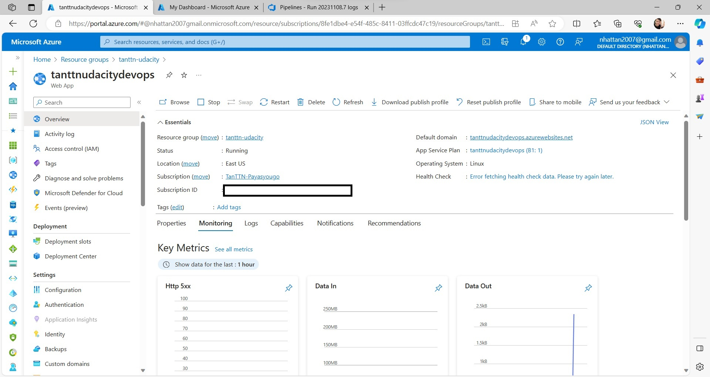

- Loadtest with web app by Locust (after deployed by Azure DevOps Pipelines)
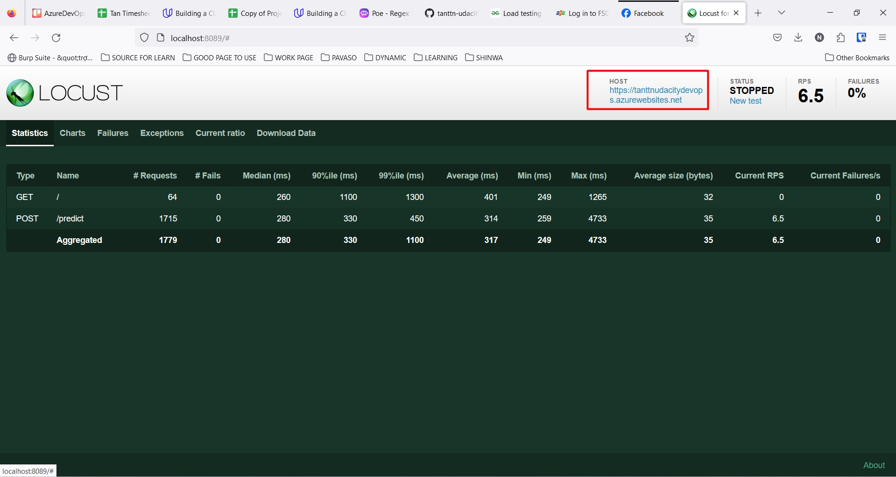

### Azure DevOps

- Go to Azure Devops > Create new project

- Go to Project Settings > Service Connections > New Service Connections
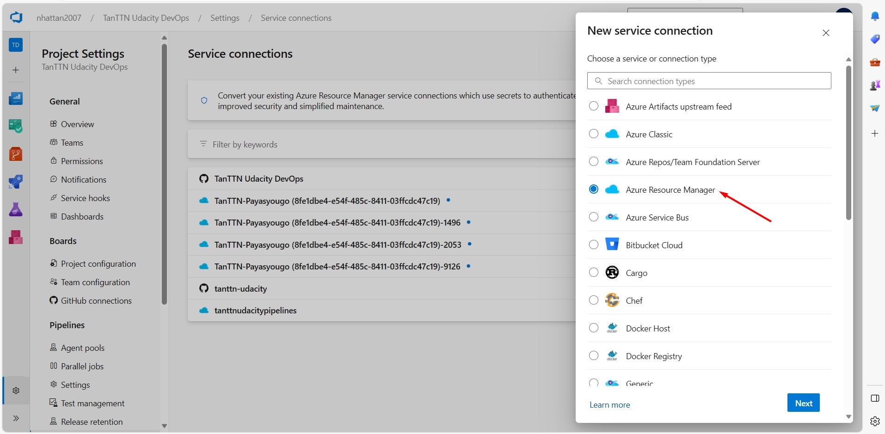

- Select Azure Resource Manager > Select your Resource Group and Subscription (Also checkbox Grant access permission to all pipelines)
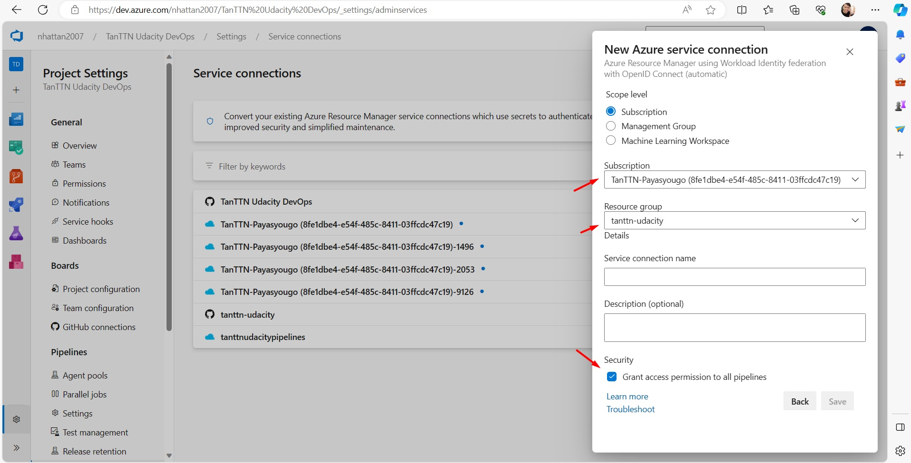

- Back to project Pipelines > New pipeline > Select Github > Grant access to your github
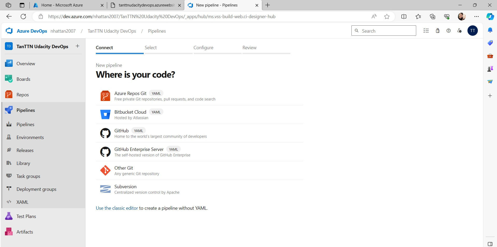

- Select your repository > Select Configure template
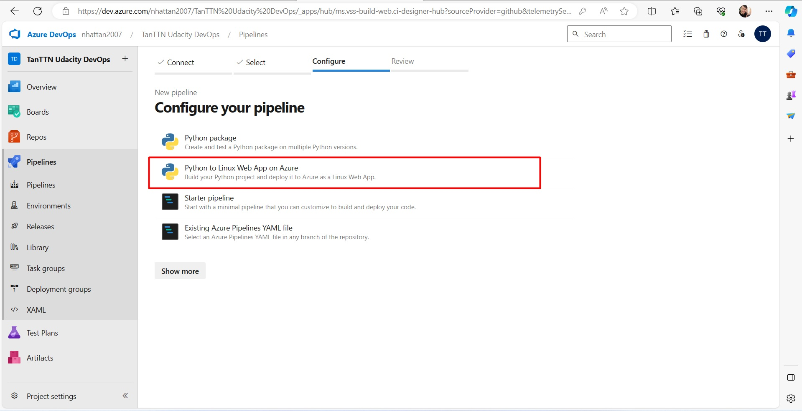

- Select your subscription > Select your web app which you want to deploy
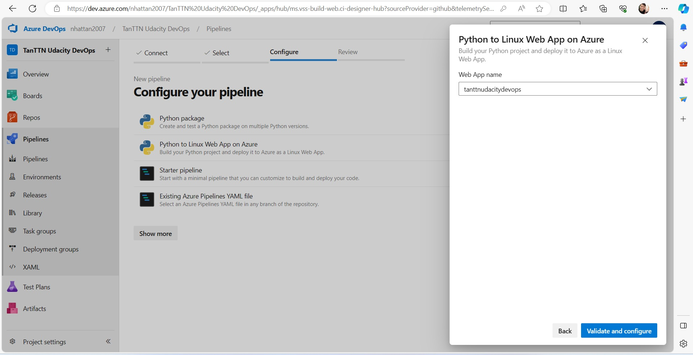

- Successful deploy of the project in Azure Pipelines.
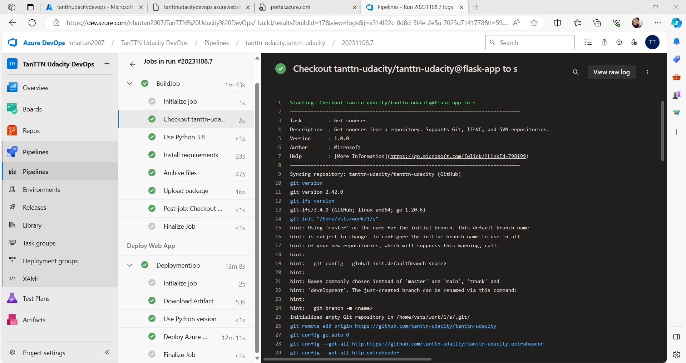

- Project running on Azure App Service
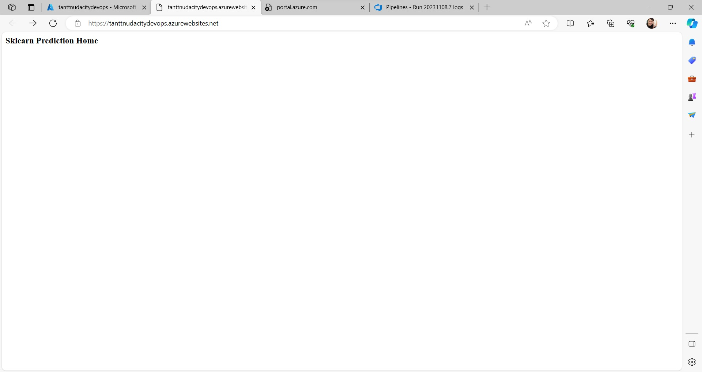

- Web App with Azure Pipelines
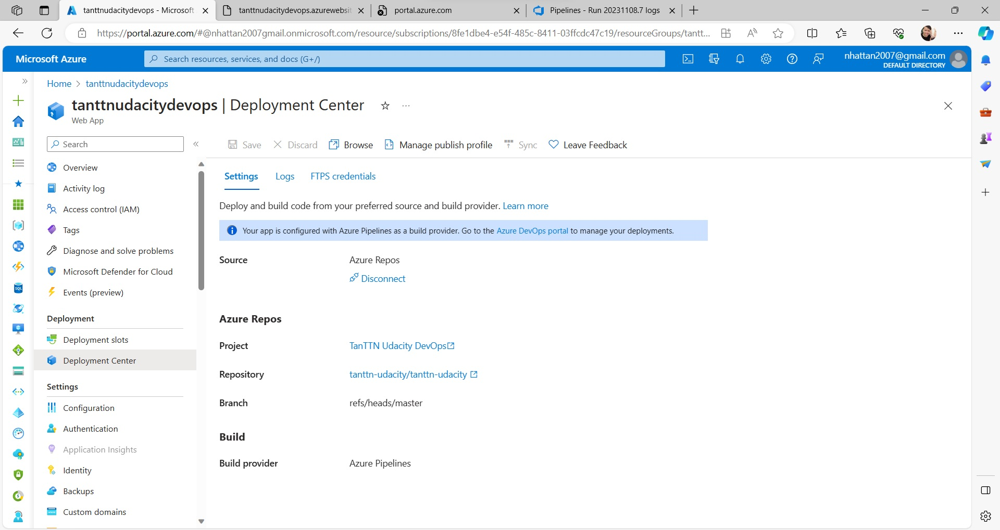

- Web App Deployed Logs
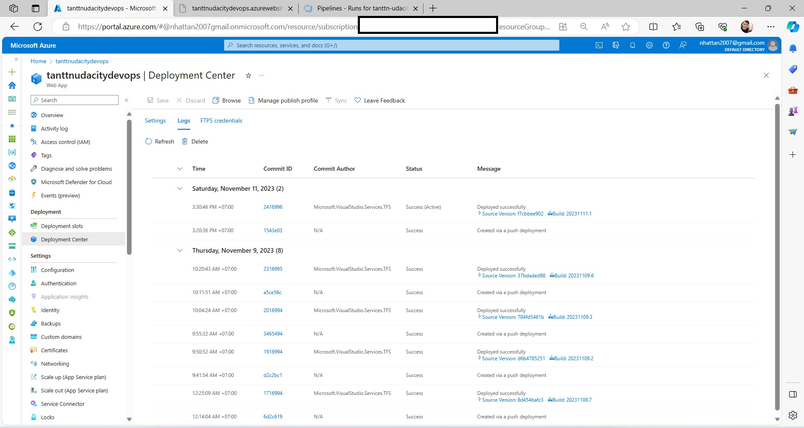

- Output of streamed log files from deployed application
  Web App Stream Logs

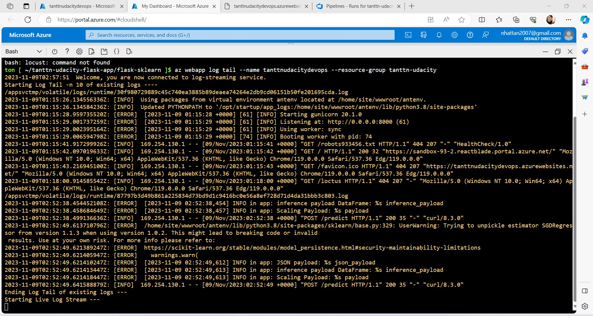

## Enhancements

- Upgrade to newer python version (example that I did is 3.8)
- Add configuration key by KeyVault.

## Demo

<TODO: Add link Screencast on YouTube>
